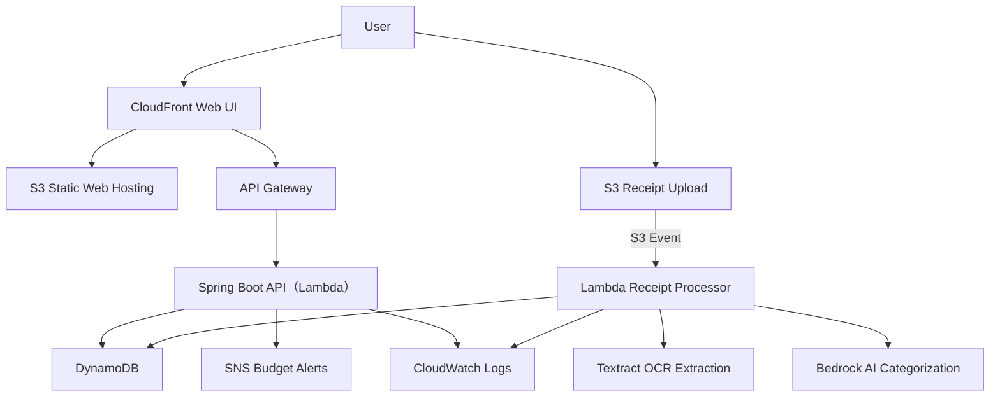

## プロジェクト概要
Smart Expense Tracker は、レシートや請求書をアップロードするだけで個人の支出管理を自動化するクラウドネイティブな家計簿アプリです。
Amazon Textract による OCR とAmazon Bedrock による AI カテゴリ分類を組み合わせて、支出データを自動で構造化し、月次レポートや予算アラートを生成します。

## 目的
- 手動入力の手間をなくし、支出管理を自動化する  
- AI によるカテゴリ分類で精度の高い家計簿を実現  
- 月次レポートや支出傾向の可視化で家計改善を支援  
- AWS サーバレス構成を使ったクラウドネイティブアプリの実践

## 機能要件
### 1. ユーザー管理
- ユーザー登録（メール＋パスワード）
- ログイン／ログアウト
- パスワードリセット
- プロフィール管理（任意）

### 2. レシートアップロード
- JPEG/PNG/PDF をアップロード
- S3 に保存（プライベートバケット）
- アップロード完了後、S3 イベントで Lambda の自動解析処理を起動

### 3. レシート解析（Lambda）
- Textract で以下を抽出（OCR）
  - 店舗名  
  - 日付  
  - 合計金額  
  - 明細（品目・金額）
- Bedrock でカテゴリ分類（AI）
  - 食費 / 交通費 / ショッピング / 医療 / 教育 / 光熱費

### 4. 支出データ保存（DynamoDB）
保存項目例：

| 項目 | 内容 |
|------|------|
| userId | CognitoのユーザーID |
| expenseId | PK、UUIDを使う |
| date | 支出日 |
| store | 店舗名 |
| total | 合計金額 |
| items | 明細リスト |
| category | AI分類カテゴリ |
| createdAt | 登録日時 |

### 5. 支出一覧・検索
- 月別、年別一覧
  - 必要に応じて、日付範囲検索
- カテゴリ検索
- （必要に応じて、）店舗名検索

### 6. 月次レポート
- 月間支出合計
- カテゴリ別支出グラフ（ダッシュボードから表示可能？）
  - 対象月のカテゴリ別支出額割合を示す円グラフ
  - 対象カテゴリの支出額の月次推移を示す棒グラフ
- 直近1年の毎月の支出額推移の棒グラフ

### 7. 予算管理・アラート
- カテゴリごとに月予算設定
- 予算超過時にアラートとして SNS 通知（メール/SMS）

### 8. データエクスポート
- CSV ダウンロード
- 月次レポートの Markdown 生成（任意）

---

## 非機能要件
### セキュリティ
- Cognito 認証必須
- S3 バケットはプライベート
- IAM ロールは最小権限
- HTTPS 必須
- DynamoDB の暗号化（KMS）

### スケーラビリティ
- Lambda による水平スケール
- DynamoDB オンデマンドで自動スケール

### コスト最適化
- サーバレス中心で従量課金
- S3＋CloudFront は低コスト

### ログ・監視
- CloudWatch Logs（Lambda・API）
- CloudWatch Metrics（API Gateway）
- エラー通知（SNS）

## アーキテクチャ図

## アーキテクチャ概要
- **CloudFront + S3**  
  Web UI をホスティングし、ユーザーがレシートをアップロードできる画面を提供。

- **API Gateway + Spring Boot API（Lambda）**  
  フロントからの API リクエストを受け、支出一覧・月次レポート・予算管理などを提供。

- **S3（レシート保存）**  
  ユーザーがアップロードした画像・PDFを保存し、Lambda のトリガーになる。

- **Lambda（解析処理）**  
  レシート解析を担当するサーバレス関数。  
  ここで Textract と Bedrock を呼び出し、結果を DynamoDB に保存する。

- **Textract（OCR）**  
  レシートから店舗名・日付・税額・合計金額・明細を抽出する。

- **Bedrock（AI分類）**  
  抽出した内容をもとに、食費／交通費／ショッピング／医療／教育／光熱費などのカテゴリに自動分類する。

- **DynamoDB（支出データ保存）**  
  構造化された解析結果（支出データ）を保存し、月次レポートや検索に利用する。

- **SNS（予算アラート）**  
  カテゴリ予算を超えた場合に通知。

- **CloudWatch（ログ・監視）**  
  Lambda と API のログ・メトリクスを管理。

## 使用する AWS サービス
| サービス | 役割 | 採用理由 |
|---------|------|----------|
| Amazon S3 | レシート画像・PDFの保存 | 耐久性・低コスト・イベントトリガーが可能 |
| AWS Lambda | Textract/Bedrock 呼び出し、解析処理。他にもSpring Boot APIで支出一覧・月次レポート・予算管理などを提供 | サーバレスで従量課金、イベント駆動に最適 |
| Amazon Textract | OCR（店舗名・日付・税額・合計金額抽出） | レシートの構造化抽出に強い |
| Amazon Bedrock | 支出カテゴリ分類、AI分析 | プロンプト変更で分類ロジック改善可能 |
| Amazon DynamoDB | 支出データ保存 | 高速書き込み・サーバレス・オンデマンド課金で低コスト、月次集計はアプリ側で計算すればJOIN不要、アクセスパターンは事前に決まっている |
| Amazon SNS | 予算超過アラート通知 | 実装が簡単、再試行・配信管理が自動、SMS通知もメール通知も可能 |
| Amazon CloudWatch | ログ・監視 | Lambda/API の標準監視ツール |

## コスト見積もり
### 1. S3 + CloudFront（レシート保存＋Webホスティング）
レシート画像：1枚200KB × 50枚 = 10MB  
Web UI：数MB  
合計：20MB程度
- ストレージ：20MB → 約3円/月
- PUT/GET リクエスト：数円
- CloudFront：数十円〜100円未満  
合計：100円前後

### 2. Lambda（レシート解析＋API）
Lambda は「実行時間 × メモリ」で課金  

**レシート解析（Textract + Bedrock 呼び出し）**
- 1回あたり 1〜2秒
- 月50回  
数円〜数十円

**API（Spring Boot on Lambda）**
- 数百〜数千リクエスト  
数円〜10円程度

合計：100円未満

### 3. Textract（OCR）
- 1枚あたり 約1.5〜2円
- 月50枚 → 約100円   
合計：100〜150円

### 4. Bedrock（AI分類）
Bedrock はモデルによるけど、分類タスクなら 1回0.1〜0.3円程度
- 月50回 → 5〜15円   
合計：10円前後

### 5. DynamoDB（支出データ保存）
オンデマンド課金で激安
- 書き込み：月50回 → 数円
- 読み込み：月数百〜数千 → 数円
- ストレージ：数MB → 数円  
合計：10〜20円

### 6. API Gateway
REST API の呼び出し数で決まる
- 月1,000リクエスト → 約40円
- 月5,000リクエスト → 約200円  
合計：50〜200円

### 7. SNS（予算アラート）
- 通知数が少なければ 数円〜10円程度  
合計：10円前後

### 8. CloudWatch Logs
ログ量で決まる
- 数MB → 数円〜数十円  
合計：10〜50円

### 総合見積もり
| サービス | 月額 |
|---------|------|
| S3 + CloudFront | 100円 |
| Lambda | 100円未満 |
| Textract | 100〜150円 |
| Bedrock | 10円前後 |
| DynamoDB | 10〜20円 |
| API Gateway | 50〜200円 |
| SNS | 10円前後 |
| CloudWatch | 10〜50円 |

合計：400〜600円/月（かなり安い）  
余裕を見ても 1,000〜3,000円/月以内に収まる

## 今後の拡張
- 支出予測（Bedrock）
- カテゴリ分類の精度向上（プロンプト改善）
- モバイルアプリ対応
- CI/CD（GitHub Actions + CDK）