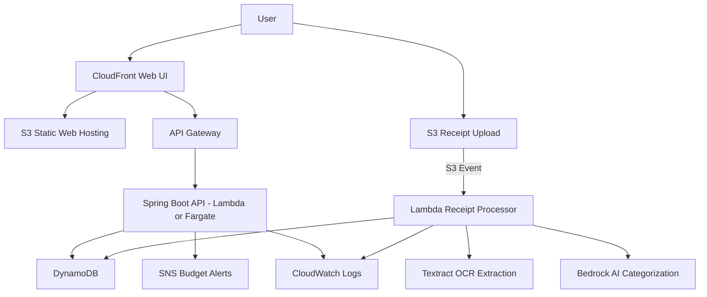

## プロジェクト概要
Smart Expense Tracker は、レシートや請求書をアップロードするだけで個人の支出管理を自動化するクラウドネイティブな家計簿アプリです。
Amazon Textract による OCR とAmazon Bedrock による AI カテゴリ分類を組み合わせて、支出データを自動で構造化し、月次レポートや予算アラートを生成します。

## 目的
- 手動入力の手間をなくし、支出管理を自動化する  
- AI によるカテゴリ分類で精度の高い家計簿を実現  
- 月次レポートや支出傾向の可視化で家計改善を支援  
- AWS サーバレス構成を使ったクラウドネイティブアプリの実践

## 機能要件
### 1. ユーザー管理
- ユーザー登録（メール＋パスワード）
- ログイン／ログアウト
- プロフィール管理（任意）

### 2. レシートアップロード
- JPEG/PNG/PDF をアップロード
- S3 に保存
- アップロード後に自動解析処理を起動（S3 → Lambda）

### 3. レシート解析（OCR＋AI）
- Textract で以下を抽出  
  - 店舗名  
  - 日付  
  - 税額  
  - 合計金額  
  - 明細（品目・金額）
- Bedrock でカテゴリ分類  
  - 食費 / 交通費 / ショッピング / 医療 / 教育 / 光熱費

### 4. 支出データ保存（DynamoDB）
保存項目例：

| 項目 | 内容 |
|------|------|
| userId | Cognito ユーザーID |
| expenseId | UUID |
| date | 支出日 |
| store | 店舗名 |
| total | 合計金額 |
| items | 明細リスト |
| category | AI分類カテゴリ |
| createdAt | 登録日時 |

### 5. 支出一覧・検索
- 日付範囲検索
- カテゴリ検索
- 店舗名検索

### 6. 月次レポート
- 月間支出合計
- カテゴリ別支出グラフ
- 前月比
- 支出傾向の可視化

### 7. 予算管理・アラート
- カテゴリごとに月予算設定
- 予算超過時に SNS 通知（メール/SMS）

### 8. データエクスポート
- CSV ダウンロード
- 月次レポートの Markdown 生成（任意）

---

## 非機能要件
### セキュリティ
- Cognito 認証必須
- S3 バケットはプライベート
- IAM ロールは最小権限
- HTTPS 必須
- DynamoDB の暗号化（KMS）

### スケーラビリティ
- Lambda による水平スケール
- DynamoDB オンデマンドで自動スケール

### コスト最適化
- サーバレス中心で従量課金
- S3＋CloudFront は低コスト

### ログ・監視
- CloudWatch Logs（Lambda・API）
- CloudWatch Metrics（API Gateway）
- エラー通知（SNS）

## アーキテクチャ図

## アーキテクチャ概要
- **CloudFront + S3**  
  Web UI をホスティングし、ユーザーがレシートをアップロードできる画面を提供。

- **API Gateway + Spring Boot API**  
  フロントからの API リクエストを受け、支出一覧・月次レポート・予算管理などを提供。

- **S3（レシート保存）**  
  ユーザーがアップロードした画像・PDFを保存し、Lambda のトリガーになる。

- **Lambda（解析処理）**  
  Textract と Bedrock を呼び出し、OCR → AI分類 → DynamoDB保存までを自動実行。

- **Textract（OCR）**  
  店舗名・日付・税額・合計金額・明細を抽出。

- **Bedrock（AI分類）**  
  食費／交通費／ショッピング／医療／教育／光熱費などに自動分類。

- **DynamoDB（支出データ保存）**  
  構造化された支出データを保存し、月次レポートや検索に利用。

- **SNS（予算アラート）**  
  カテゴリ予算を超えた場合に通知。

- **CloudWatch（ログ・監視）**  
  Lambda と API のログ・メトリクスを管理。

## 使用する AWS サービス
| サービス | 役割 | 採用理由 |
|---------|------|----------|
| Amazon S3 | レシート画像・PDFの保存 | 耐久性・低コスト・イベントトリガーが可能 |
| AWS Lambda | Textract/Bedrock 呼び出し、解析処理 | サーバレスで従量課金、イベント駆動に最適 |
| Amazon Textract | OCR（店舗名・日付・税額・合計金額抽出） | レシートの構造化抽出に強い |
| Amazon Bedrock | 支出カテゴリ分類、AI分析 | プロンプト変更で分類ロジック改善可能 |
| Amazon DynamoDB | 支出データ保存 | 高速書き込み・サーバレス・オンデマンド課金 |
| Amazon SNS | 予算超過アラート通知 | シンプルで高速な通知サービス |
| Amazon CloudWatch | ログ・監視 | Lambda/API の標準監視ツール |

## 今後の拡張
- 支出予測（Bedrock）
- カテゴリ分類の精度向上（プロンプト改善）
- モバイルアプリ対応
- CI/CD（GitHub Actions + CDK）